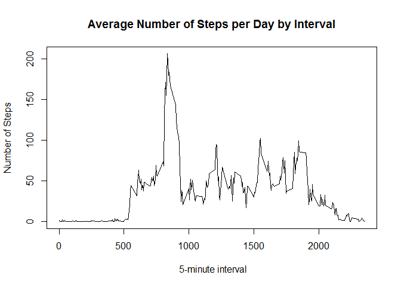

Loading the data and preprocessing
==================================

    activity <- read.csv("activity.csv")
    head(activity)

    ##   steps       date interval
    ## 1    NA 2012-10-01        0
    ## 2    NA 2012-10-01        5
    ## 3    NA 2012-10-01       10
    ## 4    NA 2012-10-01       15
    ## 5    NA 2012-10-01       20
    ## 6    NA 2012-10-01       25

    names(activity)

    ## [1] "steps"    "date"     "interval"

    library(lattice)
    activity$date<-as.Date(activity$date,'%Y-%m-%d')

What is mean total number of steps taken per day?
=================================================

1.  Calculate the toral number of steps taken per day.  
2.  Make a histogram of the total number of steps taken each day

<!-- -->

    totalsteps <- aggregate(steps~date,activity,sum,na.rm = TRUE)
    hist(totalsteps$steps, main ="Total steps by day", xlab = "day", col = "red")

1.  Calculate and report the mean and median of the total number of
    steps taken per day

<!-- -->

    rmean<-mean(totalsteps$steps)
    rmedian<-median(totalsteps$steps)

The mean is 1.076618910^{4} and the median is 10765

What is the average daily activity parttern?
============================================

-   Make a time series plot (i.e. type = "l") of the 5-minute interval
    (x-axis) and the average number of steps taken, averaged across all
    days (y-axis)

<!-- -->

    steps_by_interval<-aggregate(steps~interval, activity,mean,na.rm = "TRUE")
    plot(steps_by_interval$interval,steps_by_interval$steps, type = "l", xlab = " 5-minute interval",ylab="Number of Steps", main = "Average Number of Steps per Day by Interval")

Which 5-minute interval, on average across all the days in the dataset,
contains the maximum number of steps?

    max_interval<-steps_by_interval[which.max(steps_by_interval$steps),1]

The 5-minute interval, on average across all the days in the data set,
containing the maximum number of steps is 835

Imputing missing values
=======================

Calculate and report the total number of missing values in the dataset
(i.e. the total number of rows with NAs)

    activity_NA <- sum(is.na(activity))

The total number of missing value is 'r activity\_NA'

Devise a strategy for filling in all of the missing values in the
dataset. The strategy does not need to be sophisticated. For example,
you could use the mean/median for that day, or the mean for that
5-minute interval, etc.

Strategy: Use mean in 5 min interval to replace NA

    StepsAverage <- aggregate(steps ~ interval, activity, FUN = mean, na.rmm = TRUE)
    fillNA <- numeric()
    for (i in 1:nrow(activity)) {
        obs <- activity[i, ]
        if (is.na(obs$steps)) {
            steps <- subset(StepsAverage, interval == obs$interval)$steps
            } else {
                steps <- obs$steps
                }
        fillNA <- c(fillNA, steps)
        }

Create a new dataset that is equal to the original dataset but with the
missing data filled in.

    new_activity <- activity
    new_activity$steps <- fillNA

Make a histogram of the total number of steps taken each day and
Calculate and report the mean and median total number of steps taken per
day. Do these values differ from the estimates from the first part of
the assignment? What is the impact of imputing missing data on the
estimates of the total daily number of steps?

    StepsTotal2 <- aggregate(steps ~ date, data = new_activity, sum, na.rm = TRUE)
    hist(StepsTotal2$steps, main = "Total steps by day", xlab = "day", col = "red")

    rmean2<-mean(StepsTotal2$steps)
    rmedian2<-median(StepsTotal2$steps)

The mean is 1.076618910^{4} and median is 1.076618910^{4}.  
The mean is unchanged. But the median is different, because we add more
point to the data thus shift the poisition of the median number.

Are there differences in activity patterns between weekdays and weekends?
=========================================================================

For this part the weekdays() function may be of some help here. Use the
dataset with the filled-in missing values for this part.

Create a new factor variable in the dataset with two levels ??
??weekday?? and ??weekend?? indicating whether a given date is a weekday
or weekend day.

    Sys.setlocale("LC_TIME", "English")

    ## [1] "English_United States.1252"

    day <- weekdays(activity$date)
    daylevel <- vector()
    for (i in 1:nrow(activity)) {
        if (day[i] == "Saturday") {
            daylevel[i] <- "Weekend"
            }  else if (day[i] == "Sunday") {
                daylevel[i] <- "Weekend"
                }else {
                    daylevel[i] <- "Weekday"
                    }
        }
    activity$daylevel <- daylevel
    activity$daylevel <- factor(activity$daylevel)

    stepsByDay <- aggregate(steps ~ interval + daylevel, data = activity, mean)
    names(stepsByDay) <- c("interval", "daylevel", "steps")

Make a panel plot containing a time series plot (i.e. type = “l”) of the
5-minute interval (x-axis) and the average number of steps taken,
averaged across all weekday days or weekend days (y-axis). The plot
should look something like the following, which was creating using
simulated data:

    library(lattice)
    xyplot(steps ~ interval | daylevel, stepsByDay, type = "l", layout = c(1, 2), 
           xlab = "Interval", ylab = "Number of steps")

